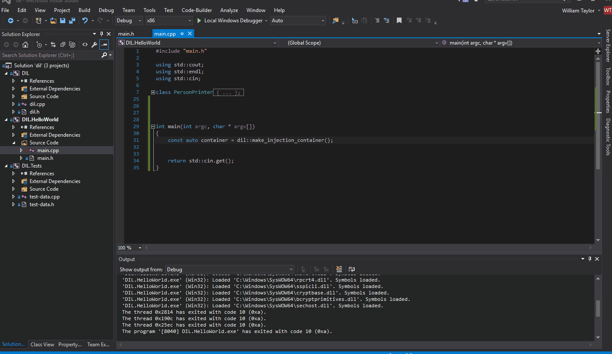

# Injection Container     [](https://ci.appveyor.com/project/william-taylor/dil) [](https://github.com/ellerbrock/open-source-badge/) [](https://opensource.org/licenses/Apache-2.0)

DIL is a dependency injection container for C++ applications that I built for personal use. As C++14 introduced RTTI (Run Time Type Information) I wanted to see if it would be possible to do a simple injection container that operated like the containers you find in Java and C# which of course have runtime type information as well. I managed to get it working and plan to use it in projects in the future.

## Overview

This project is just a simple implementation of constructor based dependency injection in C++. It’s small and lightweight and will be taken forward and improved as time progresses. Type information is captured in lambdas and then constructed and deallocated when new instances of this type are asked for from the container. It allows you to easily create mocks of abstractions for easier testing and allows you to write new exciting implementations which can sit alongside older code without the need to change allocations.

```c++
class Mapping : public Interface {
 Abstraction * abs;
 Mapping(dil::container * container) {
  // Request them
  container->query(&abs);
 }
}

void bootstrapper() {
  const auto container = dil::make_injection_container();
  container->supply<Abstraction, Dependency>(); // Supply implementations
  container->supply<Interface, Mapping>();
  container->lock();
  ...
}
```

## Features

* Dynamically inject class dependencies via the `dil::container` object.
* Remove memory leaks through lifetime objects attached to objects.
* Easily change mappings for easier testing and better customizability.
* Allows easy mocking of implementations for easy unit testing.

## Development

* Inject and resolve key based globals.
* Object analysis to see what objects are used most.
* Memory information on objects constructed.
* Lockable containers

## License

Apache 2.0

